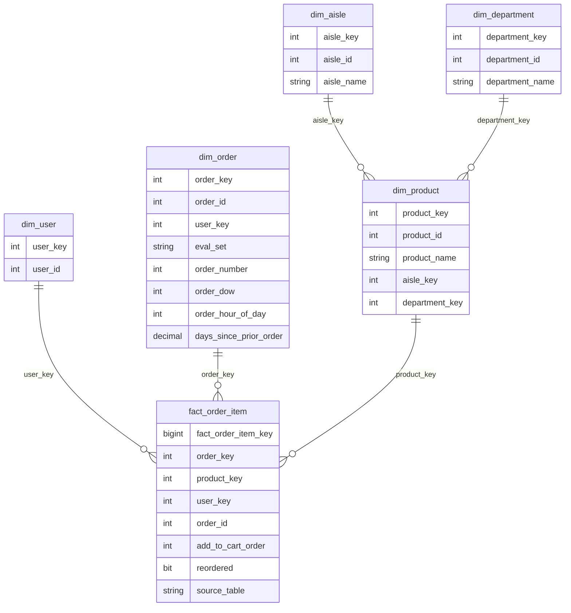

# Instacart Market Basket Analysis — Business Analytics Project

## 1. Project Overview

This project analyses the Instacart Market Basket Analysis dataset to understand customer reorder behaviour, basket composition, product/category performance, and cross-category purchasing patterns in an online grocery retail environment. I built a SQL Server-based analytics pipeline that imports raw CSV files, validates data quality, transforms the data into a dimensional warehouse model, and runs business-focused SQL queries to identify reorder drivers, repeat-purchase patterns, and recommendation opportunities. The Power BI dashboard layer is currently in development and will extend these SQL findings into a business-facing visual report.

---

## 2. Business Problem

An online grocery retailer needs better visibility into customer reorder behaviour, basket composition, and category relationships in order to improve repeat purchasing, support cross-sell opportunities, and design more effective product recommendation strategies.

This project focuses on answering:

- Which products, aisles, and departments drive the highest purchase and reorder activity?
- How does reorder behaviour change as customers place more orders?
- Which product categories are frequently purchased together?
- What insights can support retention, merchandising, and recommendation strategy?

---

## 3. Key Findings

Numbers are rounded for readability.

- **Banana was the most-ordered product**, appearing around **491K times** across customer baskets.
- **Overall reorder rate was around 59%**, showing that repeat purchasing is a major behaviour pattern in the dataset.
- **Reorder behaviour strengthened as customers placed more orders**, rising from **0% on first orders** to around **60% by order 8**, suggesting habit formation over repeated shopping cycles.
- **Produce and dairy eggs formed the strongest cross-category pair**, co-occurring in around **1.84M orders**, indicating a strong natural relationship between fresh produce and staple grocery items.
- **Milk had one of the highest aisle-level reorder rates at around 78%**, suggesting it behaves as a routine replenishment category.
- **High-volume departments were not always the highest-reorder departments**, meaning merchandising strategy should separate volume-driving categories from loyalty-driving categories.

---

## 4. Architecture / Data Model

The project uses a two-schema SQL architecture:

- **`raw` schema** — stores the imported CSV files in a structure close to the original source data.
- **`dw` schema** — stores the transformed dimensional model used for analysis and reporting.

The warehouse layer follows a star-schema-style design with five dimension tables and one central fact table.



### 4.1 Design Decisions

- **Surrogate keys** were used in the warehouse layer to create cleaner relationships, reduce dependency on source-system keys, and support future slowly changing dimension design if the model is extended.
- The central fact table is an **event/transaction fact table at order-item grain**. Each row represents one product within one order. Because the dataset does not include price, revenue, or quantity, the fact table is mainly used for counting events and analysing behavioural fields such as `reordered` and `add_to_cart_order`.
- A separate date table was not created because the dataset does not include real calendar dates. Instead, time-related attributes such as `order_dow`, `order_hour_of_day`, `order_number`, and `days_since_prior_order` are stored in `dim_order`.

### 4.2 Limitations and Known Simplifications

- The dataset does not include real calendar dates, so time analysis is limited to relative patterns such as day of week, hour of day, order sequence, and days since prior order.
- The dataset does not include price, revenue, profit, or product quantity, so financial performance analysis is not possible from this source alone.
- The current warehouse model uses a single-load design. Slowly changing dimension logic is not implemented yet, but the use of surrogate keys makes it easier to extend the model later.

---

## 5. Dataset

**Dataset:** Instacart Market Basket Analysis  
**Source:** Kaggle  
**Dataset link:** https://www.kaggle.com/datasets/psparks/instacart-market-basket-analysis

| File | Purpose | Approx. Row Count |
|---|---|---:|
| `orders.csv` | Order-level data including user, order sequence, day of week, hour of day, and days since prior order | 3.4M |
| `order_products__prior.csv` | Historical order-product transaction rows | 32M |
| `order_products__train.csv` | Training order-product transaction rows | 1.4M |
| `products.csv` | Product names and product-to-category mappings | 50K |
| `aisles.csv` | Aisle-level product hierarchy | 134 |
| `departments.csv` | Department-level product hierarchy | 21 |

---

## 6. Validation Results

After loading the warehouse model, I validated the data using `08_dw_validation.sql`.

The validation checks covered:

- Raw-to-DW row count reconciliation
- Surrogate-key density checks
- Fact-to-dimension referential integrity
- Product-to-aisle and product-to-department integrity
- Order weekday and hour range checks
- Source-to-target consistency checks

All validation checks passed.


### 6.1 Reorder Rate by Department

This query compares department-level item volume and reorder rate to identify which departments act as repeat-purchase drivers.


### 6.2 Department Pair Frequency

This query identifies departments frequently purchased together in the same order. These results support cross-sell and recommendation strategy.


---

## 7. How to Run

Run the SQL files in order from the `sql/` folder.

### Step 1 — Create database and schemas

```text
01_database_setup.sql
```

Creates the `InstacartBA` database and the `raw` and `dw` schemas.

### Step 2 — Create raw tables

```text
02_raw_tables.sql
```

Creates the raw staging tables that mirror the source CSV structure.

### Step 3 — Create indexes and raw views

```text
03_indexes_and_views.sql
```

Creates supporting indexes and the unified order-product view used for downstream transformation.

### Step 4 — Import raw CSV files

```text
04_import_raw_data.sql
```

Before running this file, update the `@BasePath` variable to match the folder where the CSV files are stored.

Example:

```sql
DECLARE @BasePath NVARCHAR(500) =
N'C:\Users\Admin\Downloads\InstaCart Online Grocery Market Basket Analysis\';
```

### Step 5 — Validate raw data

```text
05_raw_validation.sql
```

Checks raw table row counts, nulls, duplicates, value ranges, and missing relationships.

### Step 6 — Create DW tables

```text
06_dw_tables.sql
```

Creates the dimensional warehouse model, including surrogate keys and foreign key constraints.

### Step 7 — Load DW tables

```text
07_load_dw.sql
```

Loads the dimension and fact tables from the raw schema. This file temporarily drops foreign key constraints before truncating and reloading the warehouse tables, then recreates the constraints using `WITH CHECK`.

### Step 8 — Validate DW model

```text
08_dw_validation.sql
```

Validates row counts, surrogate-key integrity, foreign key integrity, and source-to-target consistency.

### Step 9 — Run business analysis queries

```text
09_business_queries.sql
```

Runs the main SQL analysis queries covering reorder behaviour, basket patterns, department performance, product performance, user behaviour, and cross-category relationships.

---

## 8. Tech Stack

| Tool | Purpose |
|---|---|
| SQL Server 2022 Express | Database, raw layer, warehouse model, transformations, validation, and SQL analysis |
| SQL Server Management Studio | Query development and database management |
| Power BI Desktop | Dashboard and visual storytelling layer |
| Kaggle Instacart Dataset | Source dataset |

> Update the SQL Server, SSMS, and Power BI versions before publishing if your installed versions are different.

---

## 9. Performance Note

The largest load step is the order-item fact table, which is built from more than 33M order-product rows. On a local machine, the full load time will depend heavily on CPU, memory, disk speed, and whether indexes and foreign key checks are enabled during loading.

---

## 10. What’s Next

The SQL pipeline, warehouse model, validation layer, and business query layer are complete.

The next phase is the Power BI dashboard, which will include:

1. **Executive Overview**  
   Total orders, total users, average basket size, reorder rate, and ordering patterns.

2. **Product and Category Insights**  
   Department volume, reorder rate, top products, and aisle-level performance.

3. **Customer Repeat Behaviour**  
   User order frequency, reorder behaviour by order sequence, and basket-size patterns.

4. **Basket and Recommendation Insights**  
   Department-pair analysis, cross-category relationships, and recommendation opportunities.

---

## 11. Project Status

| Component | Status |
|---|---|
| SQL database setup | Complete |
| Raw data import | Complete |
| Raw data validation | Complete |
| DW star schema | Complete |
| DW load process | Complete |
| DW validation | Complete |
| Business SQL queries | Complete |
| Power BI dashboard | In progress |
| Python analysis | Planned |
| Final portfolio write-up | Planned |

---

## 12. Author

Built by **[Your Name]**  
LinkedIn: **[Your LinkedIn URL]**  
Portfolio: **[Your portfolio URL]**

---

## 13. Portfolio Summary

This project demonstrates an end-to-end Business Analytics workflow using SQL Server to transform raw relational grocery transaction data into a validated dimensional warehouse model. The analysis identifies reorder behaviour, basket composition, department performance, and cross-category purchasing patterns that can support product recommendation, retention, and merchandising decisions.

